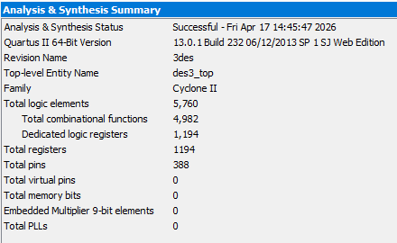
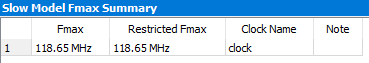
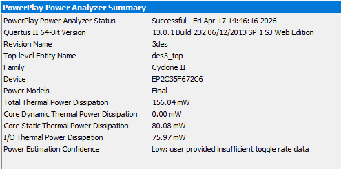

# Triple DES (3DES) in Verilog

This repository contains a complete, synthesizable Hardware Description Language (HDL) implementation of the **Triple Data Encryption Standard (3DES)** algorithm written in Verilog. 

The implementation fully complies with the **NIST FIPS 46-3** standard, covering the Encryption-Decryption-Encryption (EDE) operational mode with three independent 64-bit keys (Keying Option 1).

## Features

- **Fully Standardized**: Implements all permutations (IP, FP, E, P, PC-1, PC-2), S-boxes, and the key schedule as specified in FIPS 46-3.
- **Synthesizable RTL**: Pure Verilog 2001 compatible, easily targetable to FPGAs (Intel/Altera, Xilinx) and ASICs.
- **3DES EDE Mode**: Performs standard Triple DES Encryption (Encrypt-Decrypt-Encrypt) and Decryption (Decrypt-Encrypt-Decrypt).
- **FSM-based Control**: Uses a Finite State Machine to control the 16 encryption/decryption rounds, balancing area and speed.
- **High Validation Confidence**: Source code, permutation indexes, and shift amounts have been meticulously reviewed and strictly follow standard specifications.

## Architecture

Triple DES applies the standard DES cipher algorithm three times to each data block. The system utilizes three 64-bit keys (`key0`, `key1`, `key2`), where each key contains 56 bits of actual key material and 8 bits for parity.

### Encryption Path (`des3_encrypt.v`)
`Ciphertext = E(K2, D(K1, E(K0, Plaintext)))`

### Decryption Path (`des3_decrypt.v`)
`Plaintext = D(K0, E(K1, D(K2, Ciphertext)))`

## Module Hierarchy

- `des3_top.v` - Top-level wrapper module demonstrating both encryption and decryption chains.
  - `des3_encrypt.v` - 3DES Encryption wrapper.
  - `des3_decrypt.v` - 3DES Decryption wrapper.
    - `des_encrypt.v` - Standard DES Encryption core (16 rounds FSM).
    - `des_decrypt.v` - Standard DES Decryption core (16 rounds FSM, reversed key schedule).
      - `des_ip_stage.v` - Initial Permutation (IP).
      - `fp_perm.v` - Final Permutation (IP⁻¹).
      - `f_func.v` - The Feistel function, consisting of:
        - `e_expand.v` - Expansion permutation (E).
        - `des_sboxes.v` - All 8 substitution boxes (S-boxes).
        - `p_permutation32.v` - P-permutation.
      - `pc1_perm.v` - Key Schedule: Permitted Choice 1 (PC-1).
      - `pc2_perm.v` - Key Schedule: Permitted Choice 2 (PC-2).

## Interface

### `des3_top`
```verilog
module des3_top (
    input         clock,
    input         rst,
    input         start,          // Triggers the operation
    input  [63:0] key0,           // 1st 64-bit key
    input  [63:0] key1,           // 2nd 64-bit key
    input  [63:0] key2,           // 3rd 64-bit key
    input  [63:0] plaintext_in,   // 64-bit data input
    
    output [63:0] ciphertext_out, // Intermediate encryption result
    output [63:0] recovered_out,  // Final decryption result (matches plaintext_in)
    output        done_all        // High when operation has completed
);
```
*Note: In the `des3_top` module, `plaintext_in` goes through the encrypter to generate `ciphertext_out`, which is immediately fed into the decrypter to produce `recovered_out`. This serves as a system-level loopback test.*

## Usage & Synthesis

This IP can be used in Quartus Prime, Xilinx Vivado, or any standard EDA tool. 
1. Add all `.v` files to your project.
2. Set either `des3_top`, `des3_encrypt`, or `des3_decrypt` as your top-level entity, depending on your application needs.
3. Assert the `start` (or `select`) signal high for one clock cycle alongside valid `data_in` and `key` signals.
4. Wait for the `done` signal to assert high, at which point the `output_data` will be valid.

## Implementation Details & Bug Fixes

Recent updates to the core have stabilized the following aspects:
- Port mapping mismatch (`.clk` vs `.clock`) in sub-modules has been resolved.
- Timing inconsistency of the `done` signal between the encrypter and decrypter has been unified. Both modules now assert `done` precisely at the `DONE` FSM state.
- Unused routing ports (`L0`, `R0`) have been stripped to ensure clean compilation without warnings.
- Endianness and permutation indexes precisely map to the 1-indexed tables of FIPS 46-3 format (converting $Index_{Verilog} = MaximumBits - Index_{FIPS}$).

## Resource Utilization & Performance

The design (`des3_top`) was synthesized and analyzed using Quartus II (Cyclone II family, device `EP2C35F672C6`). The implementation yields the following performance metrics:

### Analysis & Synthesis Summary

| Resource Type | Utilization |
|---|---|
| **Total logic elements** | 5,760 |
| &nbsp;&nbsp;&nbsp;&nbsp;*Total combinational functions* | 4,982 |
| &nbsp;&nbsp;&nbsp;&nbsp;*Dedicated logic registers* | 1,194 |
| **Total registers** | 1,194 |
| **Total pins** | 388 |
| **Total memory bits** | 0 |
| **Embedded Multiplier 9-bit elements** | 0 |

<p align="center">
  
</p>


### Timing Analysis (Slow Model)

| Metric | Value | Note |
|---|---|---|
| **Fmax** | 118.65 MHz | `clock` domain |
| **Restricted Fmax** | 118.65 MHz | |

<p align="center">
  
</p>


### Power Analysis (PowerPlay Power Analyzer)

| Power Metric | Dissipation |
|---|---|
| **Total Thermal Power** | 156.04 mW |
| **Core Dynamic Thermal Power** | 0.00 mW |
| **Core Static Thermal Power** | 80.08 mW |
| **I/O Thermal Power** | 75.97 mW |

<p align="center">
  
</p>


## License

This project is open-source and available under the terms of the MIT License.
